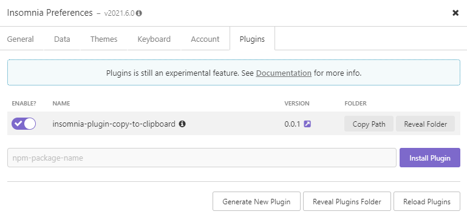
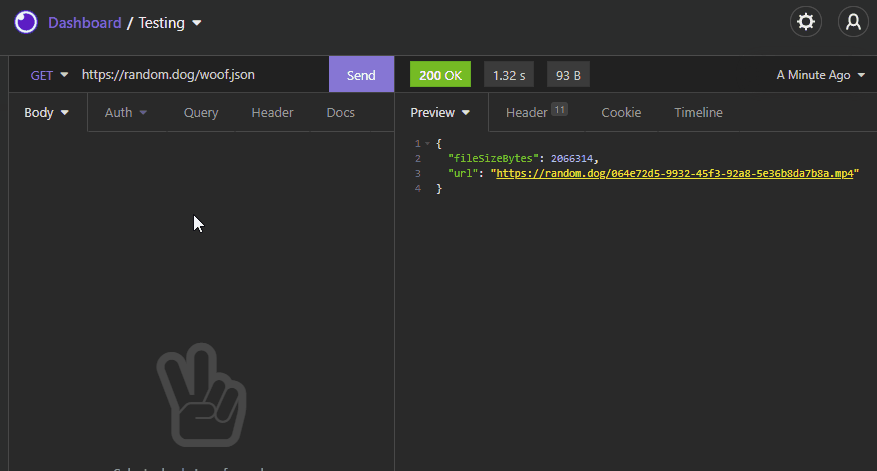

# Copy response or property value to the clipboard

This is a simple insomnia plugin to copy the response or property value to the clipboard.

## Pre-requisites

This plugin requires [Insomnia](https://insomnia.rest/), the Open Source API client.

## Installation

1. Start Insomnia,
2. Click "Application" -> "Preferences" and choose the "Plugins" tab,
3. Enter `insomnia-plugin-copy-to-clipboard` and click "Install Plugin".

    

4. Close the dialog.

## Usage

1. Go to a request in any collection,
2. Add a new query item,
3. Press Cmd/Ctrl + Space and choose "Copy To Clipboard",
4. Click the "Copy To Clipboard" tag,
5. In "Property to copy" set the property you want to copy, or leave it blank to copy the entire response,
6. Click done, cross your fingers and give it a go!

    

## Limitations

* It only works with json objects when setting a property to copy

## Contributing

In case you want to improve it, PRs are welcome! :)
